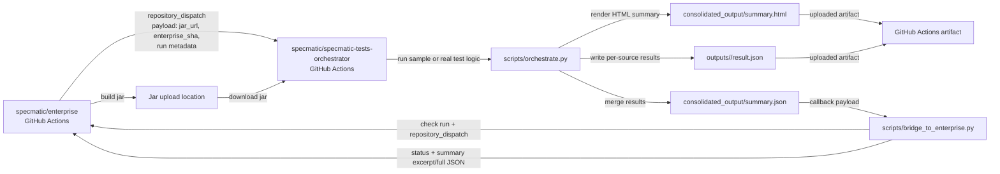
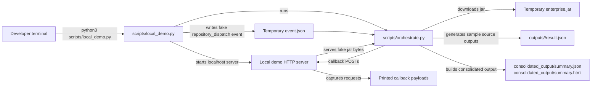

# Specmatic Tests Orchestrator

This repository is the public test-orchestration companion for `specmatic/enterprise`.

It is designed to:

1. Receive the jar URL produced by the private Enterprise build.
2. Download that jar into the workflow runner.
3. Run the Python orchestration script that produces per-source outputs.
4. Collect `summary.json` and `summary.html`.
5. Call back to the originating Enterprise build with the pass/fail result.
6. Optionally send the summary payload back to Enterprise so it can be shown in build details.

## Workflow contract

The workflow expects the following environment/input values:

- `SPECMATIC_JAR_URL`: location of the jar built by `specmatic/enterprise`
- `SPECMATIC_SUMMARY_JSON`: path to the consolidated JSON summary
- `SPECMATIC_SUMMARY_HTML`: path to the consolidated HTML summary
- `ENTERPRISE_REPOSITORY`: target repo to update, usually `specmatic/enterprise`
- `ENTERPRISE_SHA`: commit SHA in Enterprise that should receive the status/check update
- `ENTERPRISE_RUN_ID`: originating Enterprise workflow run id
- `ENTERPRISE_RUN_ATTEMPT`: originating Enterprise workflow run attempt

The default workflow layout is:

- `outputs/` for per-source result subfolders
- `consolidated_output/` for the merged `summary.json` and `summary.html`

The orchestration entrypoint is [`scripts/orchestrate.py`](./scripts/orchestrate.py), and it is also what the GitHub Actions workflow runs.

## Architecture

### Production Flow



### Dry-Run Flow



### Key Pieces

- `specmatic/enterprise` is the upstream build producer.
- `specmatic/specmatic-tests-orchestrator` is the test runner and callback relay.
- [`scripts/orchestrate.py`](./scripts/orchestrate.py) owns the end-to-end execution path.
- [`scripts/consolidate_outputs.py`](./scripts/consolidate_outputs.py) turns source-level results into a single summary.
- [`scripts/bridge_to_enterprise.py`](./scripts/bridge_to_enterprise.py) sends the final callback to Enterprise.
- [`scripts/local_demo.py`](./scripts/local_demo.py) simulates the full system locally without GitHub.
- [`tests/test_orchestrate_end_to_end.py`](./tests/test_orchestrate_end_to_end.py) verifies the same end-to-end flow as an automated test.

## How Enterprise triggers this workflow

The recommended approach from `specmatic/enterprise` is to send a `repository_dispatch` event to this repository after the jar is built and uploaded.

Example:

```yaml
- name: Trigger Specmatic orchestrator
  env:
    GH_TOKEN: ${{ secrets.ORCHESTRATOR_TRIGGER_TOKEN }}
    JAR_URL: ${{ steps.upload_jar.outputs.jar_url }}
  run: |
    gh api repos/specmatic/specmatic-tests-orchestrator/dispatches \
      -X POST \
      -f event_type=specmatic-enterprise-jar-ready \
      -f client_payload[jar_url]="$JAR_URL" \
      -f client_payload[enterprise_repository]="specmatic/enterprise" \
      -f client_payload[enterprise_sha]="$GITHUB_SHA" \
      -f client_payload[enterprise_run_id]="$GITHUB_RUN_ID" \
      -f client_payload[enterprise_run_attempt]="$GITHUB_RUN_ATTEMPT"
```

The token stored in `ORCHESTRATOR_TRIGGER_TOKEN` needs permission to create repository dispatch events in `specmatic/specmatic-tests-orchestrator`.

If the jar is private or temporary, `SPECMATIC_JAR_URL` must be a URL that the orchestrator runner can actually download.

The callback step uses `ENTERPRISE_CALLBACK_TOKEN`, which should be a GitHub token that can:

- create check runs or commit statuses in `specmatic/enterprise`
- send a `repository_dispatch` event back to `specmatic/enterprise`

For local integration tests, the bridge also honors `GITHUB_API_BASE_URL`, which lets the callback target a temporary localhost server instead of `https://api.github.com`.

## How the callback works

After the Python run finishes, `scripts/bridge_to_enterprise.py`:

- reads `summary.json`
- infers success or failure from the summary payload
- creates a GitHub check run on the Enterprise commit
- sends a `repository_dispatch` event back to Enterprise with a compact summary payload

If the raw JSON is small enough, the callback includes the full `summary.json` body.
If it is too large for GitHub's dispatch payload limits, the callback includes a truncated excerpt and a `summary_json_truncated` flag instead.

The check run is the best place to surface a human-readable result in GitHub UI.

## Local end-to-end test

[`tests/test_orchestrate_end_to_end.py`](./tests/test_orchestrate_end_to_end.py) simulates the full flow:

1. Receives a fake `repository_dispatch` trigger.
2. Spins up a local HTTP server to serve the jar and accept callback POSTs.
3. Runs [`scripts/orchestrate.py`](./scripts/orchestrate.py).
4. Verifies `outputs/` and `consolidated_output/` were created.
5. Verifies the callback check run and dispatch payloads were sent.

## Local smoke run

If you want to exercise the same flow manually, run:

```bash
python3 scripts/local_demo.py
```

That will:

1. Spin up a local server that serves a fake jar and accepts callbacks.
2. Feed a fake `repository_dispatch` trigger into [`scripts/orchestrate.py`](./scripts/orchestrate.py).
3. Generate sample `outputs/` and `consolidated_output/` directories.
4. Print the captured callback payloads.

## What Enterprise needs

In `specmatic/enterprise`, you will need to:

1. Add a build step that uploads the jar somewhere reachable by the orchestrator.
2. Trigger this repository with `repository_dispatch` or `workflow_dispatch`.
3. Pass `SPECMATIC_JAR_URL`, the Enterprise commit SHA, and the Enterprise run metadata.
4. Store a token secret that can call back into Enterprise from this public repo.
5. If you want the original Enterprise Actions run page to show the summary text, add a follow-up workflow in Enterprise that listens for the callback dispatch and writes the returned summary into `GITHUB_STEP_SUMMARY` or creates a check run.

### Important limitation

GitHub Actions cannot retroactively edit the finished job summary of a different repository's workflow run. The usual patterns are:

- create a check run on the Enterprise commit
- trigger a follow-up Enterprise workflow that renders the summary
- or have the Enterprise workflow wait synchronously for the orchestrator result and write the summary itself

## Default file paths

The workflow uses:

- `outputs/`
- `consolidated_output/summary.json`
- `consolidated_output/summary.html`

Adjust these paths if your Python code writes elsewhere.
