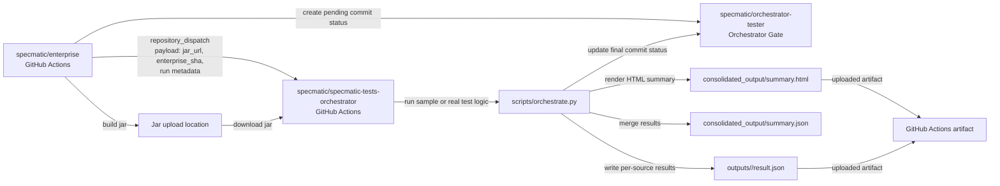
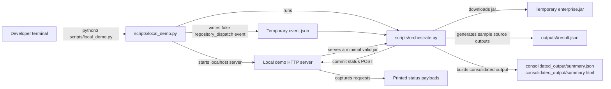
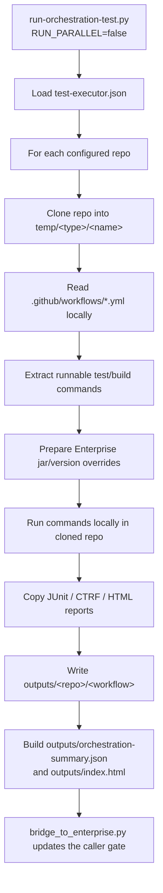
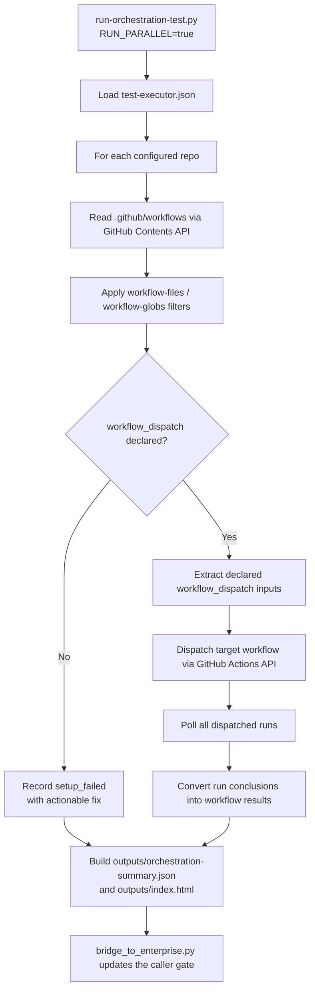

# Specmatic Tests Orchestrator

This repository is the public test-orchestration companion for `specmatic/enterprise`.

It is designed to:

1. Receive the jar URL produced by the private Enterprise build.
2. Download that jar into the workflow runner.
3. Run the Python orchestration script that produces per-source outputs.
4. Collect `summary.json` and `summary.html`.
5. Update the commit status with the pass/fail result when tests finish.

## Workflow contract

The workflow expects the following environment/input values:

- `SPECMATIC_JAR_URL`: location of the jar built by `specmatic/enterprise`
- `ENTERPRISE_VERSION`: Enterprise version under test, for example `1.12.1-SNAPSHOT`
- `ORCHESTRATOR_TEST_EXECUTOR_PATH`: optional override for the manifest used by tests or manual runs. Relative paths are resolved from the repo root.
- `SPECMATIC_SUMMARY_JSON`: path to the orchestration JSON summary, usually `outputs/orchestration-summary.json`
- `SPECMATIC_SUMMARY_HTML`: path to the orchestration HTML dashboard, usually `outputs/index.html`
- `ENTERPRISE_REPOSITORY`: target repo to update, usually `specmatic/enterprise`
- `ENTERPRISE_SHA`: commit SHA in Enterprise that should receive the status/check update
- `ENTERPRISE_RUN_ID`: originating Enterprise workflow run id
- `ENTERPRISE_RUN_ATTEMPT`: originating Enterprise workflow run attempt

For snapshot versions, the GitHub workflow installs the requested Enterprise
version and creates a temporary local Maven repository before running Gradle
sample-project tests. This mirrors a developer machine that already has the
snapshot in the local Maven cache.

The default workflow layout is:

- `outputs/` for per-source result subfolders
- `consolidated_output/` for the merged `summary.json` and `summary.html`
- `resources/test-executor.json` for the default test manifest
- `tests/resources/` for scenario fixtures used by automated tests

The orchestration entrypoint is [`scripts/orchestrate.py`](./scripts/orchestrate.py), and it is also what the GitHub Actions workflow runs.

## Architecture

### Production Flow



### Dry-Run Flow



### Key Pieces

- `specmatic/enterprise` is the upstream build producer.
- `specmatic/specmatic-tests-orchestrator` is the test runner and status updater.
- [`scripts/orchestrate.py`](./scripts/orchestrate.py) owns the end-to-end execution path.
- [`scripts/consolidate_outputs.py`](./scripts/consolidate_outputs.py) turns source-level results into a single summary.
- [`scripts/bridge_to_enterprise.py`](./scripts/bridge_to_enterprise.py) is a legacy helper kept for reference only.
- [`scripts/local_demo.py`](./scripts/local_demo.py) simulates the full system locally without GitHub.
- [`tests/test_orchestrate_end_to_end.py`](./tests/test_orchestrate_end_to_end.py) verifies the same end-to-end flow as an automated test.
- [`tests/test_orchestrate_invalid_jar_end_to_end.py`](./tests/test_orchestrate_invalid_jar_end_to_end.py) verifies invalid jar handling before tests start.
- [`tests/resources/`](./tests/resources) contains success and failure manifest fixtures for test scenarios.

## Sequential vs Parallel Execution

The current Enterprise test runner is [`scripts/run-orchestration-test.py`](./scripts/run-orchestration-test.py). It supports two execution modes from the same test-executor manifest.

- Sequential mode is used when `RUN_PARALLEL=false` or `--run-parallel` is not supplied.
- Parallel mode is used when `RUN_PARALLEL=true` or `--run-parallel` is supplied.

### Sequential Mode

Sequential mode clones each configured repository locally into `temp/`, discovers the configured GitHub workflow files from the checkout, extracts runnable shell commands, runs those commands in the local runner, copies reports into `outputs/`, and then writes one consolidated summary.



Use sequential mode when target workflows do not have `workflow_dispatch`, or when the orchestrator must run commands locally exactly as extracted from the target workflow YAML.

### Parallel Mode

Parallel mode does not clone target repositories for workflow discovery. Instead, it reads each target repo's `.github/workflows` directory through the GitHub Contents API, filters workflows based on the manifest, keeps only workflows that declare `workflow_dispatch`, dispatches all of them, waits for the resulting GitHub Actions runs, and then writes the consolidated summary.



Parallel mode requires the token passed as `ORCHESTRATOR_GITHUB_TOKEN`, `SPECMATIC_GITHUB_TOKEN`, or `GITHUB_TOKEN` to be able to read workflow files, dispatch target workflows, and read workflow runs in each target repository.

Target workflows must include `workflow_dispatch`. For example:

```yaml
on:
  workflow_dispatch:
    inputs:
      enterprise_version:
        required: false
        type: string
      enterprise_artifact_url:
        required: false
        type: string
  push:
    branches: [main]
```

If a workflow does not declare `workflow_dispatch`, parallel mode will not try to clone or run it locally. It will report `setup_failed` with an actionable step telling you to either add `workflow_dispatch`, narrow the manifest, or run sequentially.

## How Enterprise triggers this workflow

The recommended approach from `specmatic/enterprise` is to send a `repository_dispatch` event to this repository after the jar is built and uploaded.

Example:

```yaml
- name: Trigger Specmatic orchestrator
  env:
    GH_TOKEN: ${{ secrets.ORCHESTRATOR_TRIGGER_TOKEN }}
    JAR_URL: ${{ steps.upload_jar.outputs.jar_url }}
    ENTERPRISE_VERSION: 1.12.1-SNAPSHOT
  run: |
    gh api repos/specmatic/specmatic-tests-orchestrator/dispatches \
      -X POST \
      -f event_type=specmatic-enterprise-jar-ready \
      -f client_payload[jar_url]="$JAR_URL" \
      -f client_payload[enterprise_repository]="specmatic/enterprise" \
      -f client_payload[enterprise_sha]="$GITHUB_SHA" \
      -f client_payload[enterprise_run_id]="$GITHUB_RUN_ID" \
      -f client_payload[enterprise_run_attempt]="$GITHUB_RUN_ATTEMPT" \
      -f client_payload[enterprise_version]="$ENTERPRISE_VERSION"
```

The token stored in `ORCHESTRATOR_TRIGGER_TOKEN` needs permission to create repository dispatch events in `specmatic/specmatic-tests-orchestrator`.

If you want to manually test a different orchestrator scenario from this workflow, pass `test_executor_path` when using `workflow_dispatch`. The orchestrator workflow will use that file instead of `resources/test-executor.json`.

If the jar is private or temporary, `SPECMATIC_JAR_URL` must be a URL that the orchestrator runner can actually download.

The status update step uses `ENTERPRISE_CALLBACK_TOKEN`, which should be a GitHub token that can:

- update commit statuses on the target repo commit
- read the target repo metadata needed for the status update

For local integration tests, the orchestrator also honors `GITHUB_API_BASE_URL`, which lets the status update target a temporary localhost server instead of `https://api.github.com`.

## How the status update works

After the Python run finishes, `scripts/orchestrate.py`:

- reads `summary.json`
- infers success or failure from the summary payload
- writes a commit status update back to the target repo commit
- includes the summary payload in the workflow logs and summaries

If the raw JSON is small enough, the summary markdown includes the full `summary.json` body.
If it is too large, the summary includes a truncated excerpt so the workflow page stays readable.

## Local end-to-end test

[`tests/test_orchestrate_end_to_end.py`](./tests/test_orchestrate_end_to_end.py) simulates the full flow:

1. Receives a fake `repository_dispatch` trigger.
2. Spins up a local HTTP server to serve the jar and accept status POSTs.
3. Runs [`scripts/orchestrate.py`](./scripts/orchestrate.py).
4. Verifies `outputs/` and `consolidated_output/` were created.
5. Verifies the final status update payload was sent.

[`tests/test_orchestrate_failure_end_to_end.py`](./tests/test_orchestrate_failure_end_to_end.py) uses the failure fixture to prove the final status reports `failure`.

## Local smoke run

If you want to exercise the same flow manually, run:

```bash
python3 scripts/local_demo.py
```

That will:

1. Spin up a local server that serves a fake jar and accepts status updates.
2. Feed a fake `repository_dispatch` trigger into [`scripts/orchestrate.py`](./scripts/orchestrate.py).
3. Generate sample `outputs/` and `consolidated_output/` directories.
4. Print the captured status update payload.

## What Enterprise needs

In `specmatic/enterprise`, you will need to:

1. Add a build step that uploads the jar somewhere reachable by the orchestrator.
2. Trigger this repository with `repository_dispatch` or `workflow_dispatch`.
3. Pass `SPECMATIC_JAR_URL`, the Enterprise commit SHA, and the Enterprise run metadata.
4. Store a token secret that can update commit statuses on the Enterprise commit from this public repo.
5. If you want the original Enterprise Actions run page to show the summary text, add a follow-up workflow in Enterprise that reads the same status context and writes the returned summary into `GITHUB_STEP_SUMMARY`.

### Important limitation

GitHub Actions cannot retroactively edit the finished job summary of a different repository's workflow run. The usual pattern is to update the commit status on the Enterprise commit and, if desired, have a follow-up workflow render the same summary in the target repo.

## Default file paths

The workflow uses:

- `outputs/`
- `consolidated_output/summary.json`
- `consolidated_output/summary.html`

Adjust these paths if your Python code writes elsewhere.
