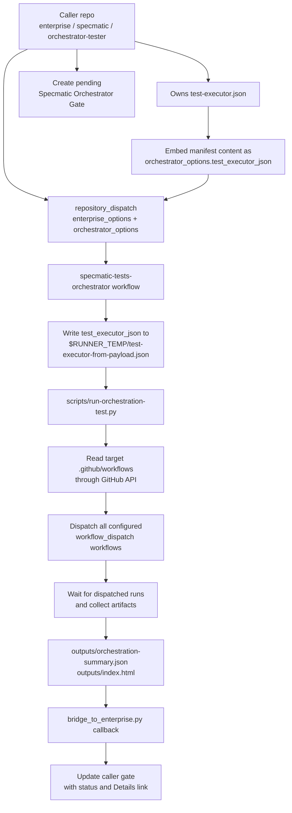
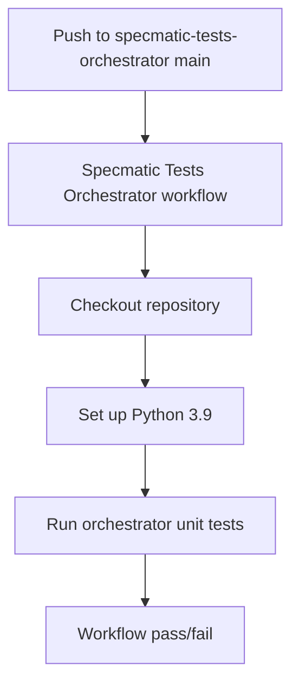
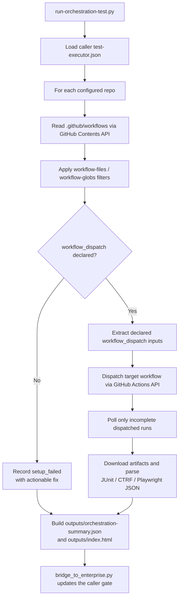

# Specmatic Tests Orchestrator

This repository is the public test-orchestration companion for Specmatic caller repositories such as `specmatic/enterprise`, `specmatic/specmatic`, and `specmatic/orchestrator-tester`.

It is designed to:

1. Receive caller metadata, jar selector/URL, and caller-owned `test_executor_json`.
2. Materialize the incoming manifest JSON in the workflow runner.
3. Dispatch the configured target repository workflows in parallel.
4. Wait for all dispatched workflows to finish.
5. Collect `outputs/orchestration-summary.json` and `outputs/index.html`.
6. Update the caller repository commit status with the pass/fail result when tests finish.
7. Run this repository's own test suite when changes are pushed to `main`.

## Workflow Contract

For caller-triggered runs, the workflow expects:

- `orchestrator_options.test_executor_json`: required caller-owned manifest content. The workflow writes it to a temporary file before running tests.
- `orchestrator_options.jar_url`: optional direct jar URL; if omitted, `enterprise_options.version` is resolved by the orchestrator.
- `orchestrator_options.enterprise_docker_image`: optional docker image override for docker-based test runs. Use this when an orchestrated run should exercise a snapshot or other non-default image.
- `enterprise_options.version`: Enterprise selector under test. Supported values include `1.12.1-SNAPSHOT`, `SNAPSHOT`, `RELEASE`, an Enterprise repository URL, or a direct Enterprise jar URL. Blank is invalid.
- `enterprise_options.repository`: caller repository to update, for example `specmatic/enterprise`.
- `enterprise_options.sha`: caller commit SHA that should receive the status update.
- `enterprise_options.status_context`: commit status context to update.
- `enterprise_options.status_target_url`: initial target URL for the status.
- `enterprise_options.configuration`: runner label used by this orchestrator run, usually `ubuntu-latest` or `windows-latest`.
- `enterprise_options.run_id`, `run_attempt`, and `run_number`: caller run metadata used for traceability.

The default workflow layout is:

- `outputs/` for per-source result subfolders
- `outputs/orchestration-summary.json` for the consolidated JSON summary
- `outputs/index.html` for the HTML dashboard
- `tests/resources/` for scenario fixtures used by automated tests. This repository does not own production `test-executor.json` files.

The GitHub Actions entrypoint is [`scripts/run-orchestration-test.py`](./scripts/run-orchestration-test.py). After it writes the summary, [`scripts/bridge_to_enterprise.py`](./scripts/bridge_to_enterprise.py) sends the existing callback status update to the triggering repository.

## Architecture

### Caller Trigger Flow



### Self-Validation Flow



### Key Pieces

- Caller repositories own their production `test-executor.json` files.
- `specmatic/specmatic-tests-orchestrator` is the test runner and status updater.
- [`scripts/run-orchestration-test.py`](./scripts/run-orchestration-test.py) dispatches target workflows, waits for completion, downloads artifacts, and writes consolidated results.
- [`scripts/consolidate_outputs.py`](./scripts/consolidate_outputs.py) turns source-level results into a single summary.
- [`scripts/bridge_to_enterprise.py`](./scripts/bridge_to_enterprise.py) updates the caller repository commit status from `outputs/orchestration-summary.json`.
- [`scripts/local_demo.py`](./scripts/local_demo.py) simulates the legacy local callback path using fixtures under `tests/resources/`.
- [`tests/test_orchestrate_end_to_end.py`](./tests/test_orchestrate_end_to_end.py) verifies the same end-to-end flow as an automated test.
- [`tests/test_orchestrate_invalid_jar_end_to_end.py`](./tests/test_orchestrate_invalid_jar_end_to_end.py) verifies invalid jar handling before tests start.
- [`tests/resources/`](./tests/resources) contains success and failure manifest fixtures for test scenarios.

## Parallel Execution

The orchestrator dispatches target workflows in configurable batches. By default it dispatches up to 3 configured target repositories at a time, waits for those GitHub Actions runs to finish, then moves to the next batch. If a dispatched executor fails before producing any test counts, the orchestrator waits for a short jittered delay and retries that executor once. It does not clone target repositories for workflow discovery. Instead, it reads each target repo's `.github/workflows` directory through the GitHub Contents API, filters workflows based on the caller-owned manifest, keeps only workflows that declare `workflow_dispatch`, dispatches each batch, waits for the resulting GitHub Actions runs, downloads artifacts, and then writes the consolidated summary.



The token passed as `ORCHESTRATOR_GITHUB_TOKEN`, `SPECMATIC_GITHUB_TOKEN`, or `GITHUB_TOKEN` must be able to read workflow files, dispatch target workflows, and read workflow runs in each target repository.

Target workflows must include `workflow_dispatch`. For example:

```yaml
on:
  workflow_dispatch:
    inputs:
      enterprise_version:
        required: false
        type: string
      enterprise_docker_image:
        required: false
        type: string
      enterprise_artifact_url:
        required: false
        type: string
  push:
    branches: [main]
```

If a workflow does not declare `workflow_dispatch`, the orchestrator reports it separately as `setup_failed` with an actionable step telling you to add `workflow_dispatch` or narrow the manifest to dispatchable workflows.

For docker-based test suites, target workflows can optionally declare `enterprise_docker_image` and forward it to the runtime. This lets the orchestrator tell Testcontainers or Docker Compose exactly which image to use without exposing snapshot-selection logic inside repository test code. When no explicit docker image override is provided and the resolved Enterprise version is a snapshot, the orchestrator now defaults to the value in `ENTEPRISE_SNAPSHOT_DOCKER_IMAGE` and falls back to `specmatic/enterprise-snapshot`.

## Triggering The Orchestrator

There are two supported ways to trigger the workflow:

- `workflow_dispatch`: useful for manual runs from the GitHub UI or `gh workflow run`.
- `repository_dispatch`: used by caller repositories such as `specmatic/enterprise`, `specmatic/orchestrator-tester`, or `specmatic/specmatic`.

### Manual Trigger From GitHub

Open [Specmatic Tests Orchestrator](https://github.com/specmatic/specmatic-tests-orchestrator/actions/workflows/specmatic-enterprise-jar-tests.yml), choose **Run workflow**, and fill in:

| Input                      | Required | Example                                                                        | Notes                                                                                                                    |
| -------------------------- | -------- | ------------------------------------------------------------------------------ | ------------------------------------------------------------------------------------------------------------------------ |
| `enterprise_repository`    | Yes      | `specmatic/enterprise`                                                         | Repository where the callback commit status should be updated. Use `specmatic/specmatic` when testing core Specmatic.    |
| `enterprise_sha`           | Yes      | `abc123...`                                                                    | Commit SHA that should receive the callback status.                                                                      |
| `enterprise_version`       | Yes      | `SNAPSHOT`, `RELEASE`, `1.12.1-SNAPSHOT`, or a jar URL                         | Blank is invalid. A direct jar URL is useful for testing a build from another branch or a different repository location. |
| `jar_url`                  | No       | `https://repo.example.com/path/specmatic.jar`                                  | Optional direct jar URL. If omitted, `enterprise_version` is resolved.                                                   |
| `enterprise_run_id`        | No       | `123456789`                                                                    | Caller workflow run id for traceability.                                                                                 |
| `enterprise_run_attempt`   | No       | `1`                                                                            | Caller workflow attempt for traceability.                                                                                |
| `enterprise_configuration` | No       | `ubuntu-latest`                                                                | Runner OS for the orchestrator run.                                                                                      |
| `test_executor_json`       | Yes      | `[{"github-url":"https://github.com/specmatic/specmatic-order-api-java.git"}]` | Caller-owned manifest content.                                                                                           |

Examples for `enterprise_version`:

- `SNAPSHOT`: latest Enterprise snapshot jar.
- `RELEASE`: latest Enterprise released jar.
- `1.12.1-SNAPSHOT`: latest timestamped jar for that snapshot version.
- `https://repo.specmatic.io/snapshots/io/specmatic/enterprise/executable-all`: latest jar below that repository URL.
- `https://repo.specmatic.io/snapshots/io/specmatic/enterprise/executable-all/1.12.1-SNAPSHOT/executable-all-1.12.1-20260427.120947-1.jar`: exact jar URL.

### Manual Trigger With GitHub CLI

Use `gh workflow run` when you want a repeatable command for a specific caller commit and jar selector.

```bash
gh workflow run specmatic-enterprise-jar-tests.yml \
  --repo specmatic/specmatic-tests-orchestrator \
  --ref main \
  -f enterprise_repository=specmatic/enterprise \
  -f enterprise_sha=<enterprise-commit-sha> \
  -f enterprise_run_id=<enterprise-run-id> \
  -f enterprise_run_attempt=1 \
  -f enterprise_version='https://repo.specmatic.io/snapshots/io/specmatic/enterprise/executable-all/1.12.1-SNAPSHOT/executable-all-1.12.1-20260427.120947-1.jar' \
  -f enterprise_configuration=ubuntu-latest \
  -f test_executor_json="$(cat .github/test-executor.json)"
```

To run the same jar against a caller-owned manifest from another repository, pass the JSON content rather than a path:

```bash
gh workflow run specmatic-enterprise-jar-tests.yml \
  --repo specmatic/specmatic-tests-orchestrator \
  --ref main \
  -f enterprise_repository=specmatic/specmatic \
  -f enterprise_sha=<specmatic-commit-sha> \
  -f enterprise_version=SNAPSHOT \
  -f enterprise_configuration=ubuntu-latest \
  -f test_executor_json="$(cat .github/test-executor.json)"
```

### Trigger From Another Workflow

Caller repositories should create a pending commit status first, then send a grouped `repository_dispatch` payload. The grouped shape keeps the request under GitHub's repository dispatch property limit and matches the workflow normalization logic.

Caller-specific test plans must be sent as `orchestrator_options.test_executor_json`. This keeps `specmatic-tests-orchestrator` agnostic to the caller repository layout.

```bash
curl -sS --fail-with-body -X POST \
  -H "Authorization: Bearer ${SPECMATIC_GITHUB_TOKEN}" \
  -H "Accept: application/vnd.github+json" \
  -H "X-GitHub-Api-Version: 2022-11-28" \
  https://api.github.com/repos/specmatic/specmatic-tests-orchestrator/dispatches \
  -d "$(jq -n \
    --arg repository "${GITHUB_REPOSITORY}" \
    --arg repository_name "${GITHUB_REPOSITORY#*/}" \
    --arg run_number "${GITHUB_RUN_NUMBER}" \
    --arg sha "${GITHUB_SHA}" \
    --arg run_id "${GITHUB_RUN_ID}" \
    --arg run_attempt "${GITHUB_RUN_ATTEMPT}" \
    --arg version "${ENTERPRISE_VERSION}" \
    --arg status_target_url "${GITHUB_SERVER_URL}/${GITHUB_REPOSITORY}/actions/runs/${GITHUB_RUN_ID}" \
    --rawfile test_executor_json .github/test-executor.json \
    '{
      event_type: "specmatic-enterprise-jar-ready",
      client_payload: {
        enterprise_options: {
          repository: $repository,
          repository_name: $repository_name,
          run_number: $run_number,
          sha: $sha,
          run_id: $run_id,
          run_attempt: $run_attempt,
          version: $version,
          status_context: "Ubuntu - Specmatic Orchestrator Gate",
          status_target_url: $status_target_url,
          configuration: "ubuntu-latest"
        },
        orchestrator_options: {
          test_executor_json: $test_executor_json
        }
      }
    }')"
```

The token needs permission to:

- create repository dispatch events in `specmatic/specmatic-tests-orchestrator`
- update commit statuses on the caller repository commit
- read target workflow files, dispatch target workflows, and read target workflow runs

If the jar is private or temporary, the jar URL must be reachable from the orchestrator runner.

For local integration tests, the orchestrator also honors `GITHUB_API_BASE_URL`, which lets the status update target a temporary localhost server instead of `https://api.github.com`.

## How The Status Update Works

After the Python run finishes, `scripts/bridge_to_enterprise.py`:

- reads `outputs/orchestration-summary.json`
- infers success or failure from the summary payload
- writes a commit status update back to the target repo commit
- includes the summary payload in the workflow logs and summaries

If the raw JSON is small enough, the summary markdown includes the full `outputs/orchestration-summary.json` body.
If it is too large, the summary includes a truncated excerpt so the workflow page stays readable.
The complete JSON is always available in the `specmatic-outputs` artifact as `outputs/orchestration-summary.json`.
